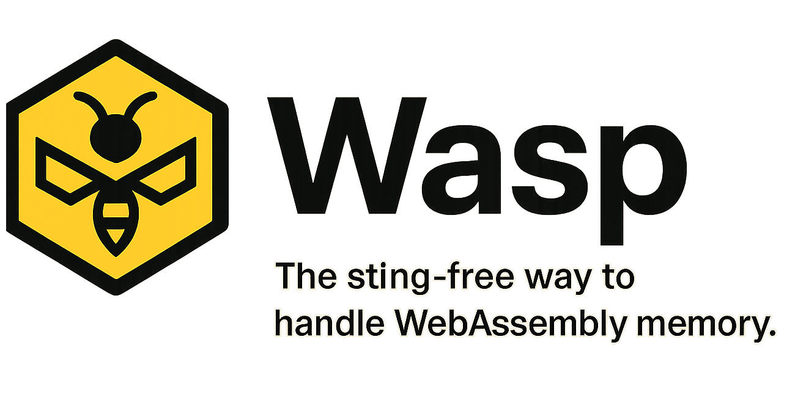

<div align="center">
  

  <h3><em>“Hexagon speed, wasp-lib precision, powered by WASM.”</em></h3>

  <p><strong>A zero-dependency TypeScript library for seamless, type-safe interaction with Emscripten-generated WebAssembly memory.</strong></p>

  <p>
    <a href="https://www.npmjs.com/package/wasp-lib"></a>
    <a href="https://github.com/ptprashanttripathi/wasp-lib/actions"></a>
    <a href="https://github.com/ptprashanttripathi/wasp-lib/blob/main/LICENSE"></a>
    <a href="https://www.typescriptlang.org/"></a>
    <a href="https://github.com/ptprashanttripathi/wasp-lib/blob/main/docs"></a>
  </p>
</div>

## 🎯 What is wasp-lib?

**wasp-lib** is a powerful TypeScript library that bridges the gap between
JavaScript and WebAssembly memory management. It transforms complex, error-prone
manual memory operations into simple, type-safe method calls, making WebAssembly
integration as easy as working with native JavaScript objects.

### The Problem

Working with WebAssembly memory directly is challenging:

- **Memory Leaks**: Forgetting to call `_free()` leads to memory leaks
- **Type Safety**: No compile-time guarantees about data types
- **Boilerplate Code**: Repetitive allocation/deallocation patterns
- **Error Prone**: Manual pointer arithmetic and buffer management

### The Solution

wasp-lib provides intuitive wrapper classes that:

- ✅ **Automatically manage memory** allocation and deallocation
- ✅ **Ensure type safety** with TypeScript generics
- ✅ **Eliminate boilerplate** with simple, chainable APIs
- ✅ **Prevent memory leaks** with built-in cleanup mechanisms

### Before vs After

#### Before wasp-lib 😰

```typescript
// Manual memory management - error-prone and verbose!
function processData(wasm: any, numbers: number[]) {
    // Allocate memory manually
    const arraySize = numbers.length * 4; // 4 bytes per i32
    const arrayPtr = wasm._malloc(arraySize);

    // Copy data byte by byte
    for (let i = 0; i < numbers.length; i++) {
        wasm.setValue(arrayPtr + i * 4, numbers[i], "i32");
    }

    // Call WASM function
    const sum = wasm._sum_array(arrayPtr, numbers.length);

    // Read result and manually free memory
    wasm._free(arrayPtr); // Easy to forget!

    return sum;
}
```

#### After wasp-lib 🎉

```typescript
// Clean, type-safe, automatic cleanup!
function processData(wasm: WASMModule, numbers: number[]) {
    const arrayPtr = ArrayPointer.from(wasm, "i32", numbers.length, numbers);
    const sum = wasm._sum_array(arrayPtr.ptr, numbers.length);
    arrayPtr.free(); // Or use readAndFree() for automatic cleanup
    return sum;
}
```

## 🌟 Key Features

- 🔒 **Type-Safe Memory Operations**: Full TypeScript support with generic types
- 🧹 **Automatic Memory Management**: Built-in allocation, deallocation, and
  cleanup
- 🎯 **Intuitive Pointer Abstractions**: High-level classes for all data types
- 📦 **Zero Dependencies**: Lightweight with no external dependencies
- ⚡ **Emscripten-Optimized**: Designed specifically for Emscripten-generated
  modules
- 🧪 **Battle-Tested**: Comprehensive test suite with 100% coverage
- 📚 **Rich Documentation**: Auto-generated API docs with examples
- 🛡️ **Memory Safety**: Built-in bounds checking and validation

## 🚀 Installation

```bash
# npm
npm install wasp-lib

# yarn
yarn add wasp-lib

# pnpm
pnpm add wasp-lib

# bun
bun add wasp-lib
```

## 🎨 Use Cases

### 1. **Image Processing**

```typescript
// Process image pixel data in WebAssembly
const pixels = new Uint8Array(width * height * 4);
const pixelPtr = ArrayPointer.from(wasm, "i8", pixels.length, [...pixels]);
wasm._apply_filter(pixelPtr.ptr, width, height);
const processedPixels = pixelPtr.readAndFree();
```

### 2. **Mathematical Computations**

```typescript
// High-performance matrix operations
const matrix = [
    [1, 2],
    [3, 4],
    [5, 6],
];
const flatMatrix = matrix.flat();
const matrixPtr = ArrayPointer.from(
    wasm,
    "double",
    flatMatrix.length,
    flatMatrix
);
const determinant = wasm._calculate_determinant(matrixPtr.ptr, 3, 2);
matrixPtr.free();
```

### 3. **String Processing**

```typescript
// Natural language processing
const text = "Hello, WebAssembly world!";
const textPtr = StringPointer.from(wasm, text.length + 100, text);
wasm._analyze_sentiment(textPtr.ptr);
const analysis = textPtr.readAndFree();
```

### 4. **Game Development**

```typescript
// Game entity positions
const positions = [
    { x: 10.5, y: 20.3, z: 0.0 },
    { x: 15.2, y: 18.7, z: 5.5 },
];
const flatPositions = positions.flatMap(p => [p.x, p.y, p.z]);
const posPtr = ArrayPointer.from(
    wasm,
    "float",
    flatPositions.length,
    flatPositions
);
wasm._update_physics(posPtr.ptr, positions.length);
const updatedPositions = posPtr.readAndFree();
```

### 5. **Scientific Computing**

```typescript
// Signal processing
const signal = new Array(1024).fill(0).map((_, i) => Math.sin(i * 0.1));
const signalPtr = ArrayPointer.from(wasm, "double", signal.length, signal);
wasm._fft_transform(signalPtr.ptr, signal.length);
const spectrum = signalPtr.readAndFree();
```

## 📖 Quick Start Guide

### Step 1: Import the Library

```typescript
import {
    StringPointer,
    ArrayPointer,
    NumberPointer,
    CharPointer,
    BoolPointer,
    TypeConverter,
} from "wasp-lib";
import type { WASMModule } from "wasp-lib";
```

### Step 2: Initialize Your WASM Module

```typescript
// Assuming you have a WASM module generated by Emscripten
import Module from "./your-wasm-module.js";

async function initWasm() {
    const wasm: WASMModule = await Module();
    return wasm;
}
```

### Step 3: Use Pointer Classes

```typescript
async function example() {
    const wasm = await initWasm();

    // String operations
    const greeting = StringPointer.from(wasm, 50, "Hello");
    wasm._process_string(greeting.ptr);
    console.log(greeting.readAndFree()); // "Hello World!" (modified by WASM)

    // Array operations
    const numbers = [1, 2, 3, 4, 5];
    const arrayPtr = ArrayPointer.from(wasm, "i32", numbers.length, numbers);
    const sum = wasm._sum_array(arrayPtr.ptr, numbers.length);
    arrayPtr.free();
    console.log(sum); // 15

    // Number operations
    const valuePtr = NumberPointer.from(wasm, "double", 3.14159);
    wasm._square_value(valuePtr.ptr);
    console.log(valuePtr.readAndFree()); // 9.869...
}
```

## 🔧 Complete API Reference

### Core Classes

#### `StringPointer`

Manages C-style null-terminated strings in WASM memory.

```typescript
class StringPointer extends BasePointer<string> {
    // Static factory methods
    static from(
        wasm: WASMModule,
        length: number,
        input?: string
    ): StringPointer;
    static alloc(wasm: WASMModule, length: number): StringPointer;

    // Instance methods
    write(input: string): void;
    read(): string;
    readAndFree(): string;
    free(): void;

    // Properties
    readonly ptr: number;
    readonly length: number;
    readonly isValid: boolean;
}
```

**Methods:**

- `from(wasm, length, input?)` - Create from JavaScript string with specified
  buffer size
- `alloc(wasm, length)` - Allocate empty buffer of specified length
- `write(input)` - Write new string content (must fit in allocated buffer)
- `read()` - Read string as JavaScript string
- `readAndFree()` - Read then immediately free memory

**Example:**

```typescript
// Create with initial content
const strPtr = StringPointer.from(wasm, 100, "Initial text");

// Modify content
strPtr.write("New content");

// Read current content
const content = strPtr.read(); // "New content"

// Clean up
strPtr.free();

// One-shot operation
const result = StringPointer.from(wasm, 50, "temp").readAndFree();
```

#### `NumberPointer<T>`

Type-safe wrapper for single numeric values.

```typescript
class NumberPointer<T extends C_NumberType> extends BasePointer<
    number | bigint
> {
    // Static factory methods
    static from<T>(
        wasm: WASMModule,
        type: T,
        input: TypedValue<T>
    ): NumberPointer<T>;
    static alloc<T>(wasm: WASMModule, type: T): NumberPointer<T>;

    // Instance methods
    write(value: TypedValue<T>): void;
    read(): TypedValue<T>;
    readAndFree(): TypedValue<T>;

    // Properties
    readonly type: T;
}
```

**Supported Types:**

- `'i8'` - 8-bit signed integer (-128 to 127)
- `'i16'` - 16-bit signed integer (-32,768 to 32,767)
- `'i32'` - 32-bit signed integer (-2,147,483,648 to 2,147,483,647)
- `'i64'` - 64-bit signed integer (uses BigInt)
- `'float'` - 32-bit floating point
- `'double'` - 64-bit floating point

**Example:**

```typescript
// Integer types
const intPtr = NumberPointer.from(wasm, "i32", 42);
const bigIntPtr = NumberPointer.from(wasm, "i64", 9007199254740991n);

// Floating point types
const floatPtr = NumberPointer.from(wasm, "float", 3.14);
const doublePtr = NumberPointer.from(wasm, "double", 2.718281828);

// Modify values
intPtr.write(84);
floatPtr.write(2.71);

// Read values (correct TypeScript types)
const intValue: number = intPtr.read(); // 84
const bigIntValue: bigint = bigIntPtr.read(); // 9007199254740991n
const floatValue: number = floatPtr.read(); // 2.71

// Clean up
[intPtr, bigIntPtr, floatPtr, doublePtr].forEach(ptr => ptr.free());
```

#### `ArrayPointer<T, N>`

Type-safe wrapper for numeric arrays with fixed-length support.

```typescript
class ArrayPointer<
    T extends C_NumberType,
    N extends number = number,
> extends BasePointer<FixedLengthArray<TypedValue<T>, N>> {
    // Static factory methods
    static from<T, N>(
        wasm: WASMModule,
        type: T,
        length: N,
        input?: TypedValue<T>[]
    ): ArrayPointer<T, N>;
    static alloc<T, N>(
        wasm: WASMModule,
        type: T,
        length: N
    ): ArrayPointer<T, N>;

    // Instance methods
    write(values: TypedValue<T>[]): void;
    add(index: number, value: TypedValue<T>): void;
    read(): FixedLengthArray<TypedValue<T>, N>;
    readAndFree(): FixedLengthArray<TypedValue<T>, N>;

    // Properties
    readonly type: T;
    readonly length: N;
}
```

**Example:**

```typescript
// Create from existing array
const numbers = [1.1, 2.2, 3.3, 4.4, 5.5];
const arrayPtr = ArrayPointer.from(wasm, "double", numbers.length, numbers);

// Allocate empty array
const emptyPtr = ArrayPointer.alloc(wasm, "i32", 10);

// Modify individual elements
arrayPtr.add(0, 10.5); // Set first element to 10.5
arrayPtr.add(4, 99.9); // Set last element to 99.9

// Write entire array
emptyPtr.write([1, 2, 3, 4, 5, 6, 7, 8, 9, 10]);

// Read array (returns fixed-length array type)
const result = arrayPtr.read(); // FixedLengthArray<number, 5>
console.log(result); // [10.5, 2.2, 3.3, 4.4, 99.9]

// Bounds checking
try {
    arrayPtr.add(10, 42); // Throws: out of bounds
} catch (error) {
    console.error(error.message); // "Out-of-bounds access: tried to write at index 10 in array of length 5"
}

arrayPtr.free();
emptyPtr.free();
```

#### `CharPointer`

Wrapper for single character values.

```typescript
class CharPointer extends BasePointer<string> {
    // Static factory methods
    static from(wasm: WASMModule, input: string): CharPointer;
    static alloc(wasm: WASMModule): CharPointer;

    // Instance methods
    write(input: string): void;
    read(): string;
    readAndFree(): string;
}
```

**Example:**

```typescript
// Create from character
const charPtr = CharPointer.from(wasm, "A");

// Modify character
charPtr.write("Z");

// Read character
const char = charPtr.read(); // 'Z'

// Validation
try {
    CharPointer.from(wasm, "AB"); // Throws: must be exactly one character
} catch (error) {
    console.error(error.message);
}

charPtr.free();
```

#### `BoolPointer`

Wrapper for boolean values (stored as C integers: 0 or 1).

```typescript
class BoolPointer extends BasePointer<boolean> {
    // Static factory methods
    static from(wasm: WASMModule, value: boolean): BoolPointer;
    static alloc(wasm: WASMModule): BoolPointer;

    // Instance methods
    write(value: boolean): void;
    read(): boolean;
    readAndFree(): boolean;
}
```

**Example:**

```typescript
// Create from boolean
const boolPtr = BoolPointer.from(wasm, true);

// Toggle value
boolPtr.write(false);

// Read value
const isTrue = boolPtr.read(); // false

// Allocate with default false
const defaultPtr = BoolPointer.alloc(wasm);
console.log(defaultPtr.read()); // false

[boolPtr, defaultPtr].forEach(ptr => ptr.free());
```

### Utility Classes

#### `TypeConverter`

Static utility class for type conversions between JavaScript and C types.

```typescript
class TypeConverter {
    // Boolean conversions
    static boolToC(value: boolean): C_BoolType; // JS boolean → C boolean (0|1)
    static boolFromC(value: C_BoolType): boolean; // C boolean → JS boolean

    // Character conversions
    static charToC(char: string): C_CharType; // Single char → ASCII code
    static charFromC(code: C_CharType): string; // ASCII code → Single char

    // Type validation
    static validateNumberType(type: string): boolean; // Validate supported type
    static getTypeSize(type: C_NumberType): number; // Get type size in bytes
}
```

**Example:**

```typescript
// Boolean conversions
const cTrue = TypeConverter.boolToC(true); // 1
const cFalse = TypeConverter.boolToC(false); // 0
const jsTrue = TypeConverter.boolFromC(1); // true
const jsFalse = TypeConverter.boolFromC(0); // false

// Character conversions
const asciiA = TypeConverter.charToC("A"); // 65
const charFromAscii = TypeConverter.charFromC(65); // 'A'

// Type validation
const isValid = TypeConverter.validateNumberType("i32"); // true
const size = TypeConverter.getTypeSize("double"); // 8

// Error handling
try {
    TypeConverter.charToC("AB"); // Throws: must be exactly one character
    TypeConverter.charFromC(300); // Throws: invalid ASCII code
    TypeConverter.getTypeSize("invalid"); // Throws: unsupported type
} catch (error) {
    console.error(error.message);
}
```

### Type Definitions

#### Core Types

```typescript
// Supported C numeric types
type C_NumberType = "i8" | "i16" | "i32" | "i64" | "float" | "double";

// C boolean type (0 or 1)
type C_BoolType = 0 | 1;

// C character type (ASCII code 0-255)
type C_CharType = number;

// Type constants
const C_TRUE: C_BoolType = 1;
const C_FALSE: C_BoolType = 0;
```

#### Size Constants

```typescript
// Size in bytes for each numeric type
const C_TYPE_SIZES: Record<C_NumberType, number> = {
    i8: 1, // 8-bit integer
    i16: 2, // 16-bit integer
    i32: 4, // 32-bit integer
    i64: 8, // 64-bit integer
    float: 4, // 32-bit float
    double: 8, // 64-bit double
};
```

#### WASM Module Interface

```typescript
interface WASMModule extends EmscriptenModule {
    // Memory management
    _malloc(size: number): number;
    _free(ptr: number): void;

    // Value operations
    setValue(ptr: number, value: number | bigint, type: string): void;
    getValue(ptr: number, type: string): number | bigint;

    // String operations
    stringToUTF8(str: string, outPtr: number, maxBytesToWrite: number): void;
    UTF8ToString(ptr: number): string;
    lengthBytesUTF8(str: string): number;

    // Function wrapping
    cwrap(ident: string, returnType: string, argTypes: string[]): Function;

    // File system (if enabled)
    FS: typeof FS;
}
```

## 🛡️ Error Handling

wasp-lib provides comprehensive error handling with descriptive messages:

### Memory Safety

```typescript
// Automatic validation
const ptr = StringPointer.from(wasm, 10, "test");
ptr.free();

try {
    ptr.read(); // Throws: "Cannot operate on freed or invalid pointer"
} catch (error) {
    console.error(error.message);
}
```

### Bounds Checking

```typescript
// Array bounds validation
const arrayPtr = ArrayPointer.alloc(wasm, "i32", 5);

try {
    arrayPtr.add(10, 42); // Throws: "Out-of-bounds access: tried to write at index 10 in array of length 5"
} catch (error) {
    console.error(error.message);
}
```

### Type Validation

```typescript
// Input validation
try {
    CharPointer.from(wasm, "AB"); // Throws: "Input must be exactly one character"
    TypeConverter.charFromC(300); // Throws: "Invalid ASCII code: 300. Must be 0-255"
    // @ts-expect-error
    TypeConverter.getTypeSize("invalid"); // Throws: "Unsupported number type: invalid"
} catch (error) {
    console.error(error.message);
}
```

### Buffer Overflow Protection

```typescript
// String length validation
const strPtr = StringPointer.alloc(wasm, 10);

try {
    strPtr.write("This string is way too long for the buffer");
    // Throws: "String length exceeds buffer size"
} catch (error) {
    console.error(error.message);
}
```

## 🚀 Performance Tips

### 1. Reuse Pointers When Possible

```typescript
// Good: Reuse pointer for multiple operations
const arrayPtr = ArrayPointer.alloc(wasm, "double", 1000);
for (let i = 0; i < iterations; i++) {
    // Modify array data
    arrayPtr.write(newData);
    wasm._process_array(arrayPtr.ptr, 1000);
}
arrayPtr.free();

// Avoid: Creating new pointers in loops
for (let i = 0; i < iterations; i++) {
    const arrayPtr = ArrayPointer.from(wasm, "double", 1000, newData); // Expensive
    wasm._process_array(arrayPtr.ptr, 1000);
    arrayPtr.free();
}
```

### 2. Use Appropriate Buffer Sizes

```typescript
// Good: Right-sized buffer
const strPtr = StringPointer.from(wasm, input.length + 10, input); // Small overhead

// Avoid: Oversized buffers
const strPtr = StringPointer.from(wasm, 10000, input); // Wastes memory
```

### 3. Batch Operations

```typescript
// Good: Process arrays in batches
const batchSize = 1000;
const arrayPtr = ArrayPointer.alloc(wasm, "float", batchSize);

for (let i = 0; i < data.length; i += batchSize) {
    const batch = data.slice(i, i + batchSize);
    arrayPtr.write(batch);
    wasm._process_batch(arrayPtr.ptr, batch.length);
}
arrayPtr.free();
```

## 📚 Advanced Examples

### Image Processing Pipeline

```typescript
async function processImage(imageData: ImageData, wasm: WASMModule) {
    // Convert ImageData to array
    const pixels = Array.from(imageData.data);

    // Create WASM array pointer
    const pixelPtr = ArrayPointer.from(wasm, "i8", pixels.length, pixels);

    // Apply multiple filters
    wasm._blur_filter(pixelPtr.ptr, imageData.width, imageData.height, 3);
    wasm._sharpen_filter(pixelPtr.ptr, imageData.width, imageData.height);
    wasm._color_correction(
        pixelPtr.ptr,
        imageData.width,
        imageData.height,
        1.2
    );

    // Get processed data
    const processedPixels = pixelPtr.readAndFree();

    // Convert back to ImageData
    const processedImageData = new ImageData(
        new Uint8ClampedArray(processedPixels),
        imageData.width,
        imageData.height
    );

    return processedImageData;
}
```

### Scientific Computing

```typescript
class Matrix {
    private data: ArrayPointer<"double", number>;

    constructor(
        private wasm: WASMModule,
        private rows: number,
        private cols: number,
        initialData?: number[]
    ) {
        this.data = ArrayPointer.from(
            wasm,
            "double",
            rows * cols,
            initialData || new Array(rows * cols).fill(0)
        );
    }

    multiply(other: Matrix): Matrix {
        if (this.cols !== other.rows) {
            throw new Error(
                "Matrix dimensions incompatible for multiplication"
            );
        }

        const result = new Matrix(this.wasm, this.rows, other.cols);

        this.wasm._matrix_multiply(
            this.data.ptr,
            other.data.ptr,
            result.data.ptr,
            this.rows,
            this.cols,
            other.cols
        );

        return result;
    }

    transpose(): Matrix {
        const result = new Matrix(this.wasm, this.cols, this.rows);
        this.wasm._matrix_transpose(
            this.data.ptr,
            result.data.ptr,
            this.rows,
            this.cols
        );
        return result;
    }

    toArray(): number[] {
        return [...this.data.read()];
    }

    free(): void {
        this.data.free();
    }
}
```

### Audio Processing

```typescript
class AudioProcessor {
    private wasm: WASMModule;
    private bufferSize: number;
    private leftChannel: ArrayPointer<"float", number>;
    private rightChannel: ArrayPointer<"float", number>;

    constructor(wasm: WASMModule, bufferSize: number) {
        this.wasm = wasm;
        this.bufferSize = bufferSize;
        this.leftChannel = ArrayPointer.alloc(wasm, "float", bufferSize);
        this.rightChannel = ArrayPointer.alloc(wasm, "float", bufferSize);
    }

    processAudio(
        leftSamples: Float32Array,
        rightSamples: Float32Array
    ): { left: Float32Array; right: Float32Array } {
        // Copy samples to WASM memory
        this.leftChannel.write([...leftSamples]);
        this.rightChannel.write([...rightSamples]);

        // Apply effects
        this.wasm._apply_reverb(
            this.leftChannel.ptr,
            this.rightChannel.ptr,
            this.bufferSize
        );
        this.wasm._apply_eq(
            this.leftChannel.ptr,
            this.rightChannel.ptr,
            this.bufferSize
        );
        this.wasm._apply_compressor(
            this.leftChannel.ptr,
            this.rightChannel.ptr,
            this.bufferSize
        );

        // Get processed samples
        const processedLeft = new Float32Array(this.leftChannel.read());
        const processedRight = new Float32Array(this.rightChannel.read());

        return { left: processedLeft, right: processedRight };
    }

    free(): void {
        this.leftChannel.free();
        this.rightChannel.free();
    }
}
```

## 🤝 Contributing

We welcome contributions! Please see our [Contributing Guide](CONTRIBUTING.md)
for details.

### Development Setup

```bash
# Clone repository
git clone https://github.com/ptprashanttripathi/wasp-lib.git
cd wasp-lib

# Install dependencies
npm install

# Build TypeScript
npm run build

# Build WASM test module
npm run build:wasm

# Run tests
npm test

# Generate documentation
npm run build:docs
```

## 📄 License

This project is [MIT](LICENSE) licensed.

## 🙏 Acknowledgments

- **Emscripten Team** - For making WebAssembly accessible
- **TypeScript Team** - For excellent type system support
- **WebAssembly Community** - For pushing the boundaries of web performance

---

<div align="center">
<p>Made with ❤️ by <a href="https://github.com/ptprashanttripathi">Pt. Prashant Tripathi</a></p>
<p>⭐ Star this repo if you find it helpful!</p>
</div>
